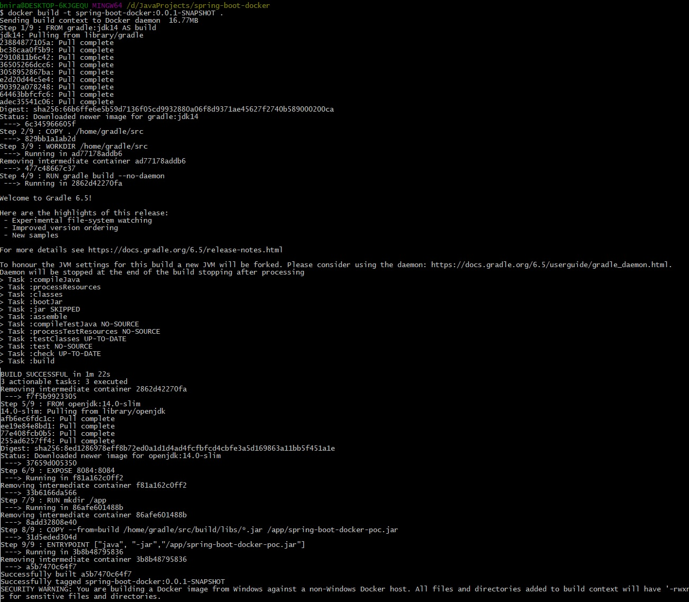
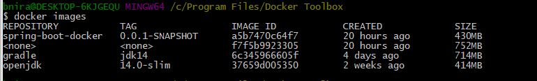
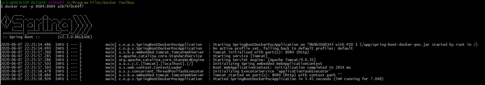
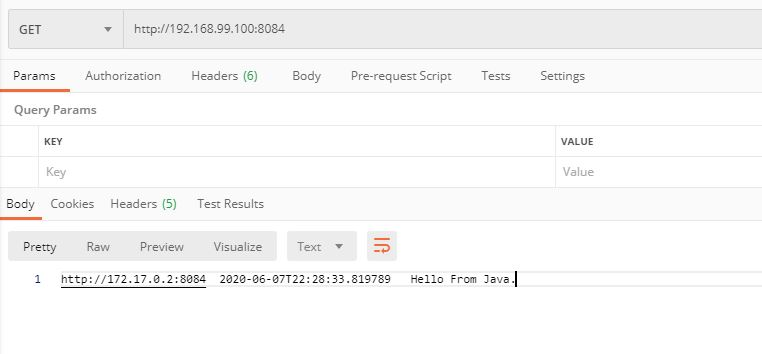
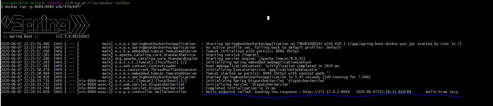
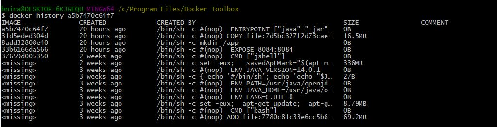

# Getting started with Spring Boot Docker

## Multistage [Dockerfile](Dockerfile) Build
 Below lines will create a jar file on the docker machine, with the help of GRADLE installed on the docker.
   - This will ensure that the JAR file is build on the same machine where we are deploying.
   - We have named this stage as **_build_**. So that it can be referenced in further stages.
>
        FROM gradle:jdk14 AS build
        #Copies the Java source code inside the container
        COPY . /home/gradle/src
        #Compiles the code and runs unit tests (with Gradle build)
        WORKDIR /home/gradle/src
        RUN gradle build --no-daemon
 Below lines will copy the jar created in **_build_** stage and will create a docker image.
>
        #Create an image using the openjdk image.
        FROM openjdk:14.0-slim
        #<HOST_PORT>:<CONTAINER_PORT>
        EXPOSE 8084:8084
        RUN mkdir /app
        #Copy the Jar that was build in build stage to /app/spring-boot-docker-poc.jar
        COPY --from=build /home/gradle/src/build/libs/*.jar /app/spring-boot-docker-poc.jar
        #Run the below command to start the container.
        ENTRYPOINT ["java", "-jar","/app/spring-boot-docker-poc.jar"]        
        
## Creating a Docker Image
Run the below command in docker terminal to start the docker build process: 
    `docker build -t spring-boot-docker:0.0.1-SNAPSHOT .`
   

## Get all docker images
 Run the below command in docker terminal to get all the images: 

     `docker images`

   

 ## Start a docker image:
 Run the below command in docker terminal to start image a5b7470c64f7: 

     `docker run -p 8084:8084 a5b7470c64f7`

   

## Make a call to docker image:
 Make a call to `http://192.168.99.100:8084` from postman: 

   
   
   Application Log in docker terminal:

   

 ## Check the Image History
 Run the below command in docker terminal to get the history of image a5b7470c64f7: 

     `docker history a5b7470c64f7`

   

## API's

| Method | Endpoint                   | Response                                                               | Description                                     |
|--------|----------------------------|------------------------------------------------------------------------|-------------------------------------------------|
| GET    | http://localhost:8084      | null:8084 2020-06-06T22:16:07.875922900 	 Hello From Java.           | Sample call place when Run locally.          |
| GET    | http://192.168.99.100:8084 | http://172.17.0.2:8084 2020-06-07T22:28:33.819789 	 Hello From Java. | Sample call placed when running in side docker. |

## References
- [Reference to build project](https://codefresh.io/docs/docs/learn-by-example/java/gradle/) 
- [Reference to Gradle Docker Images](https://hub.docker.com/_/gradle) 